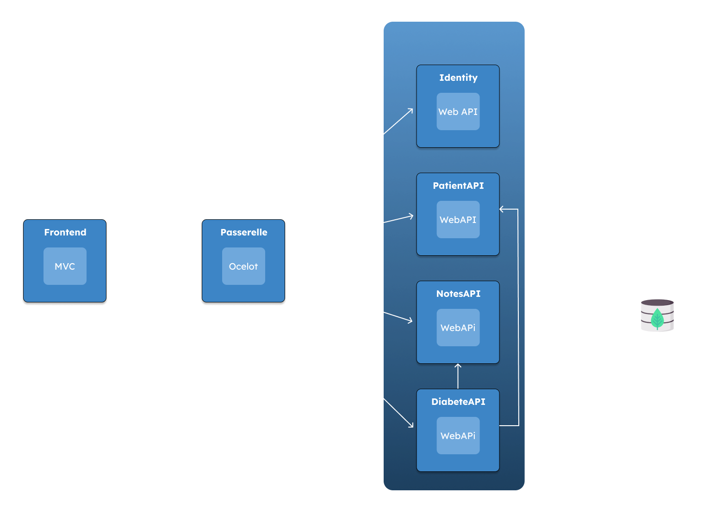

# 🎯 Medilabo Solution - Application de Détection du Diabète de Type 2
**🚑 Medilabo Solution** est une application permettant d’identifier les patients à risque de développer un diabète de type 2. Elle aide les médecins à gérer les informations des patients, ajouter des notes médicales et générer un rapport d’évaluation du risque.

## **📖 Table des matières**
- [✨ Fonctionnalités](#fonctionnalités)
- [🏗️ Architecture](#architecture)
- [🗺️ Structure du projet](#structure)
- [⚙️ Prérequis](#prérequis)
- [📥 Installation](#installation)
- [🔐 Connexion](#connexion)
- [🌿 Green Code](#greencode)    
  
## **✨ Fonctionnalités**

### **🏥 Gestion des patients**
✅ Enregistrement et modification des informations démographiques des patients (nom, âge, etc.).  
✅ Consultation des dossiers médicaux.

### **📝 Ajout de notes médicales**
✅ Les médecins peuvent ajouter des observations et suivre les comportements à risque.

### **📊 Analyse du risque de diabète**
✅ Génération d’un rapport basé sur l’âge et les notes médicales.  
✅ Identification des patients a risque.
  
## **🏗️ Architecture**
L’application est découpée en plusieurs **microservices ASP.NET Core** :

🔹 **PatientAPI** : Gère les informations des patients.  
🔹 **NoteAPI** : Permet aux médecins d’ajouter des notes sur les patients.  
🔹 **Identity** : Fournit un JWT au patient.  
🔹 **Gateway (Ocelot)** : Centralise les accès aux autres services.  
🔹 **DiabeticAssessmentAPI** : Genere le rapport de diabete du patient.  
🔹 **Frontend** : Affiche le contenu au client.  
**📦 Chaque microservice est déployé sous forme d’image Docker.**

## **🗺️ Structure du projet**



## **⚙️ Prérequis**
✔️ .NET 6 ou supérieur installé sur votre machine.  
✔️ Docker pour exécuter les microservices.

## **📥 Installation**
### **🛠️ Étapes d’installation**  
1️⃣ Clonez le dépôt Git :

```bash
git clone https://github.com/RenatoSclr/P_10_Microservices.git
```
### 🚀 Exécution du projet  
2️⃣ Execute directement via votre IDE tout les projet ou **accédez au dossier du projet et:**  

**🔹 Option 1 : Exécution locale (sans Docker)**  
Lancez chaque microservice individuellement depuis votre terminal :
```bash
dotnet run --project ./ApiGateway/ApiGateway.csproj 
```
```bash
dotnet run --project ./Frontend/Frontend.csproj
```
```bash
dotnet run --project ./Identity/Identity.csproj
```
```bash
dotnet run --project ./NotesAPI/NotesAPI.csproj
```
```bash
dotnet run --project ./PatientsAPI/PatientsAPI.csproj
```
**🔹 Option 2: Exécution avec Docker**  
Si Docker est installé, lancez tous les microservices avec :
```bash
docker-compose up -d
```
## **🔐 Connexion**
Pour accéder à l'application, utilisez les identifiants suivants :  

**👤 Nom d'utilisateur** : Usertest  
**🔑 Mot de passe** : UserTest123!
## **🌿 Green Code**
**Pourquoi 🌍 :**  
✅ Le numérique consomme un fort pourcentage d'électricité mondial et produit 4% des émissions de CO2  
✅ Les logiciels inefficaces augmentent la consommation énergétique   
✅ Le green code permet de réduire l’impact écologique du développement logiciel 

**Comment le mettre en place ♻️ :**  
✅ Optimiser les algorithme (Éviter la redondance, les boucles inutile etc..)  
✅ Réduire la consommation CPU (Éviter les structures de données lourdes)  
✅ Minimiser le poids des sites web (Compression, Cache etc..)  
✅ Limiter les requêtes réseaux (Eviter les appels API inutiles)  
✅ Faire du Clean Code et du refactoring souvent (Optimisation du code)  

**Conclusion ♻️ :**  
✅ Permet de réduire l’impact écologique   
✅ Permet d'améliorer les performance et de réduire les coûts
